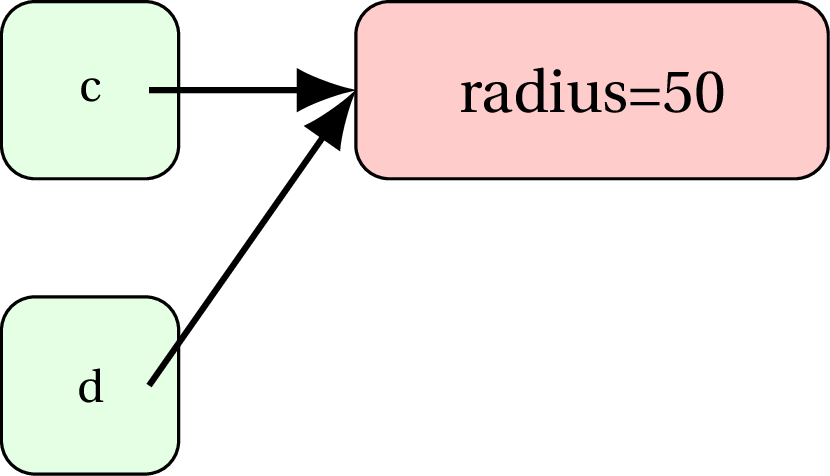
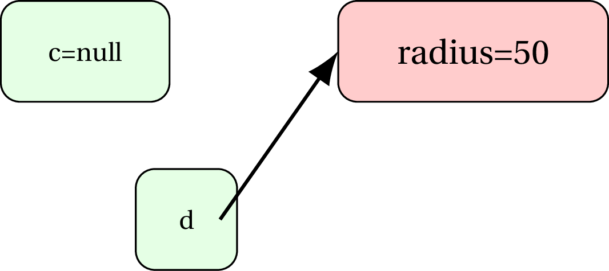
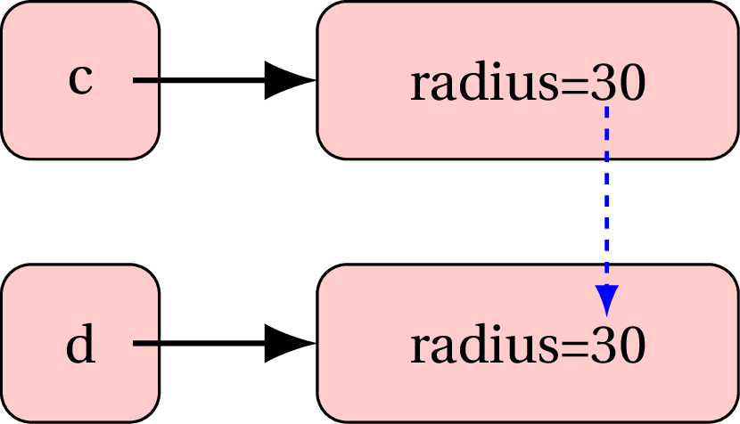

Overview
========

We explore classes and objects in more detail on the following points:

-   `this` keyword

-   Comparing objects

-   Unit testing methods of a class

-   `static` vs instance members

-   Manipulating references

`this` keyword
==============

Consider the following class definition,

``` {frame="single" style="buggy"}
public class Circle {
  private double @radius@;
  public void setRadius(double @radius@) {
    @radius@ = @Math.abs(radius)@;
  }
  //assume getter is also defined
}
```

Because the parameter and instance variable have the same name
(`radius`), it is not clear which one is affected in the assignment
statement on line 4 above. <p> &nbsp; </p> Java provides a keyword `this` that
refers to the calling object and gives access to its instance variables
and methods.

``` {frame="single" style="correct"}
public class Circle {
  private double @radius@;
  public void setRadius(double radius) {
    @this@.radius = Math.abs(radius);
  }
  //assume getter is also defined
}
  
```

Line 4 now shows that the instance variable `radius` on line 2 will be
affected by the assignment statement. As you can see, the `Math.abs`
method is using the parameter variable `radius`.

[6][Disambiguate assignment operation] Get rid of the ambiguity in the
`setSide` method

``` {frame="single" style="buggy"}
public class Square {
  private double side;
  public void setSide(double side) {
    side = Math.max(0, side);
  }
  //assume getter is also defined
}
```

    public class Square {
      private double side;
      public void setSide(double side) {
        @this.side@ = Math.max(0, side);
      }
      //assume getter is also defined
    }

Comparing objects (`compareTo` method)
======================================

The method `compareTo` provides a way to define an order on two objects
(say $a$ and $b$). The method is called on object $a$ and the object $b$
is passed as a parameter, the result indicating how $a$ compares to $b$.

You can access `private` instance members of the object passed inside a
method directly, as long as the object is of the same class as the one
the method is in.

Consider the following method in the `Circle` class,

    public class Circle {
        // other methods and instance members
        
        /* 
        comparison criterion: radius.
        return 1 if the calling object is ``more'' than other 
        -1 if its ``less''
         0 if they are ``equal'' 
         */
        public int compareTo(Circle other) {
            if(this.radius > other.radius)
              return 1;
            if(this.radius < other.radius)
              return -1;
            return 0; 
        }
      }
      

`compareTo` in action
---------------------

    Circle myCircle = new Circle(12);
      Circle yourCircle = new Circle(18);
      Circle ourCircle = new Circle(7);
      Circle theirCircle = new Circle(12);
      
      int s1 = myCircle.compareTo(yourCircle); //-1
      int s2 = myCircle.compareTo(ourCircle); //1
      int s3 = myCircle.compareTo(theirCircle); //0
      int s4 = theirCircle.compareTo(ourCircle); // ??
      int s5 = ourCircle.compareTo(yourCircle); // ??
      int s6 = yourCircle.compareTo(yourCircle); // ??
      

[6][Implement `compareTo` method] Add a `compareTo` method in class
Square that returns,

-   1 if calling object’s area is more than parameter object’s area

-   -1 if calling object’s area is less than parameter object’s area

-   0 if calling object’s area is equal to parameter object’s area

``` {frame="single" style="buggy"}
public class Square {
  private double side;
  //assume getter and setter
  public double area() {
    return side * side;
  }
}
```

    public int compareTo(Square other) {
        if(area() > other.area())
            return 1;
        if(area() < other.area())
            return -1;
        //in all other cases:
        return 0;
    }

Multi-criteria comparison
=========================

What happens if there are multiple levels of comparison criteria? For
example, if we compare two rectangles based on area, but they have the
same area, we then compare them on perimeter, and if even that’s the
same, return 0.

[7][Implement multi-criteria`compareTo` method] Add a `compareTo` method
in class `Rectangle` that returns,

-   1 if calling object’s area is more than parameter object’s area, or
    if they have the same area, but calling object’s perimeter is more
    than parameter object’s perimeter.

-   -1 if calling object’s area is less than parameter object’s area, or
    if they have the same area, but calling object’s perimeter is less
    than parameter object’s perimeter.

-   0 if calling object’s area is equal to parameter object’s area and
    calling object’s perimeter is equal to parameter object’s perimeter.

``` {frame="single" style="buggy"}
public class Rectangle {
  private double width, height;
  //assume getters and setters
  public double area() { return width * height; }
  public double perimeter() { return 2*(width + height); }
}
```

    public int compareTo(Rectangle other) {
        //first key comparison
        if(area() > other.area())
            return 1;
        if(area() < other.area())
            return -1;
        
        //second key comparison
        if(perimeter() > other.perimeter())
            return 1;
        if(perimeter() < other.perimeter())
            return -1;
        
        //still nothing?
        return 0;
    }

Unit testing methods of a class
===============================

An example class with a method that will not produce the expected result
in all situations.

``` {frame="single" style="buggy"}
public class Line {
  private int x1, y1, x2, y2;
  //other parts
  public double getMidX() {
    return x1+x2/2; //i know.
  }
}
  
```

JUnit testing
=============

JUnit provides a framework for testing individual methods. It works
based on following assertions:

1.  `assertEquals(expected double, double returned by method, tolerance)`:

    passes if,

        Math.abs(expected double - double returned by method) <= tolerance

2.  `assertEquals(expected integer, integer returned by method)`: passes
    if,

        expected integer == integer returned by method

3.  `assertTrue(boolean value)`: passes if parameter is `true`.

4.  `assertTrue(boolean value)`: passes if parameter is `false`.

5.  `assertNull(Object/array)`: passes if parameter is `null`.

6.  `assertNotNull(Object/array)`: passes if parameter is **NOT**
    `null`.

7.  More assertions can be found at:

    <http://junit.org/junit4/javadoc/latest/org/junit/Assert.html>

``` {style="junit"}

import static org.junit.Assert.*;
import org.junit.Test;
public class LineTest {
  @Test
  public void testGetMidX() {
    Line a = new Line(0, 10, 8, 12);
    assertEquals(4, a.getMidX(), 0.001); //passes
    Line b = new Line(5, 10, 6, 12);
    assertEquals(5.5, b.getMidX(), 0.001); //fails
}
```

### Corrected version by looking at JUnit failure

``` {frame="single" style="correct"}
public class Line {
  private int x1, y1, x2, y2;
  //other parts
  public double getMidX() {
    return @(x1+x2)/2.0@; 
  }
}
  
```

Static members vs. Instance members
===================================

Static members are the ones that are accessed in the context of a class.
You don’t need to create objects of that class in order to access them.
For example, consider the number of eyes **dinosaurs** have. Note, we
didn’t say, how many eyes does Dorothy the dinosaur, or Tyrone the
dinosaur have. <p> &nbsp; </p> We don’t even need any dinosaur to be alive to
answer that question, since it’s an attribute of the *collective* (the
class) rather than an *individual* (an object). <p> &nbsp; </p> On the other hand,
the variables `weight, height` are different for each dinosaur that was
there. Hence, they are *instance variables*. Similarly, the body mass
index (defined as weight divided by square of height) is an *instance
method*, that must be called on an *individual* (the object), not the
*collective* (the class) <p> &nbsp; </p> Consider the following class:

    class Dinosaur {
      public @static@ int nEyes = 2;
      public @static@ int nEars = 2;
      public @static@ double eyesToEarsRatio() {
        return nEyes * 1.0 / nEars;
      }
      
      private double weight, height;
      //assume getters, setters
      //assume parameterized constructors
      public double bodyMassIndex() {
        return weight/(height*height);
      }
    }

Static member access
--------------------

``` {style="buggy"}
int eyeCount = @Dinosaur@.nEyes;
double prop = @Dinosaur@.eyesToEarsRatio();
```

Instance member access
----------------------

``` {style="buggy"}
Dinosaur dorothy = new Dinosaur(450,3.6);
double w = @dorothy@.getWeight();
double h = @dorothy@.getHeight();
double bmi = @dorothy@.bodyMassIndex();
```

Note that in this example the instance variables are private, otherwise
(if they were public), they could be accessed in the same way (on a
calling object).

[5][Accessing static and instance members] Display the members
`data1, data2, method1, method2` of class `MyClass` (or object `obj` of
class `MyClass`) in the client code.

``` {frame="single" style="buggy"}
public class MyClass {
    public int data1;
    public static int data2;
    public static int method1() { return data2; }
    public int method2() { return data1; }
}

class Client {
    public static void main(String[] args) {
        MyClass obj = new MyClass();
        //your code 
    }
}
```

    //instance variable called on object
    System.out.println(obj.data1); 

    //static variable called on class
    System.out.println(MyClass.data2); 

    //static method called on class
    System.out.println(MyClass.method1()); 

    //instance method called on object 
    System.out.println(obj.method2()); 

Typical static methods
----------------------

Typically, methods are classified as static, if the values they operate
on are passed to the methods. For example:

    class StringService {
      public static char lastItem(String s) {
        if(s == null || s.length() == 0)
          return (char)0;
        return s.charAt(s.length() - 1);
      }
     }

    class IntegerService {
        public static int getNumberOfDigits(int num) {
            if(num == 0)
                return 0;
            // Remove any sign from number, 
            // add it to an empty string, 
            // return its length.
            return (Math.abs(num) + "").length();
        }
    }

Manipulating references
=======================

Shallow copy
------------

Consider the following class definition and client code:

      public class Circle {
        private double radius;
        //other parts
      }
      

    Circle c = new Circle(30);
      Circle d = c; 
      //c and d refer to same
      //instance variable space
      d.setRadius(50);
      System.out.println(c.getRadius()); //??
      

Object `d` holds reference to the same physical object as `c`.
Therefore, when the `radius` of object `d` is modified, `radius` of
object `c` also gets updated.



Let’s say, `c` changes to `null`.



[5][Create a shallow copy] Create a shallow copy of `myObj` into
`yourObj`. Increase the radius of `yourObj` by 2. What is the new radius
of `myObj`?

    public class Circle {
        private double radius;
        //assume getters, setters 
        // and constructors defined
    }

    class Client {
        public static void main(String[] args) {
            Circle myObj = new Circle(1.5);
            //your code
        }
    }

    Circle yourObj = myObj; //shallow copy
    youObj.setRadius(yourObj.getRadius() + 2);
    System.out.println(myObj.getRadius()); //will be 3.5

Deep copy
---------

    Circle c = new Circle(30);
      Circle d = new Circle();
      d.setRadius(c.getRadius());
      //c's radius copied into d's radius
      System.out.println(c.getRadius()); //??
      

Object `d` is a clone of object `c`. Object `c` and `d` are independent
objects. Modifying one does not alter the other.



[3][Create a deep copy] Create a deep copy of `myObj` into `yourObj`.
Increase the radius of `yourObj` by 2. What is the new radius of
`myObj`?

``` {frame="single" style="buggy"}
public class Circle {
    private double radius;
    //assume getters, setters
    // and constructors defined
}

class Client {
    public static void main(String[] args) {
        Circle myObj = new Circle(1.5);
        //your code
    }
}
```

    //create a brand-spanking new object in memory
    Circle yourObj = new Circle(); 
    //get the value for radius from myObj
    yourObj.setRadius(myObj.getRadius());
    youObj.setRadius(yourObj.getRadius() + 2);
    System.out.println(myObj.getRadius()); //will still be 1.5

Copy constructor
----------------

      public class Circle {
        private double radius;
        //setters, getters
     
        public Circle(double radius) {
            setRadius(radius);
        }
        
        public Circle(Circle other) {
            setRadius(other.radius);
        }
      }
      

[5][Define a copy constructor] Define a copy constructor in class
`Rectangle`.

``` {frame="single" style="buggy"}
public class Rectangle {
    private double width, height;
    //assume getters, setters defined
    //define copy constructor here
}
```

    public Rectangle(Rectangle source) {
        setWidth(source.getWidth());
        setHeight(source.getHeight());
    }

### Copy constructor call

      Circle c = new Circle(30);
      Circle d = new Circle(c);
      

[5][Call a copy constructor] Deep copy `myObj` into `yourObj` using the
copy constructor defined in class `Square`.

``` {frame="single" style="buggy"}
public class Square {
    private double side;
    //assume getters, setters defined
    public Square(Square other) {
        setSide(other.side);
    }
}

class Client {
    public static void main(String[] args) {
        Square myObj = new Square(2.4);
        //your code
    }
}
```

    Square yourObj = new Square(myObj);

exer
