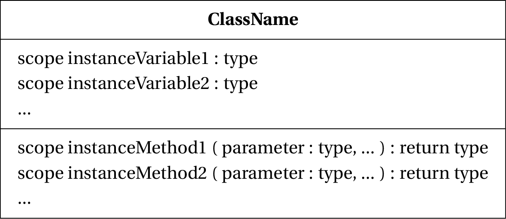
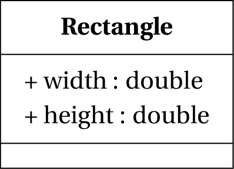
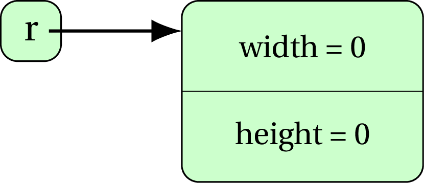
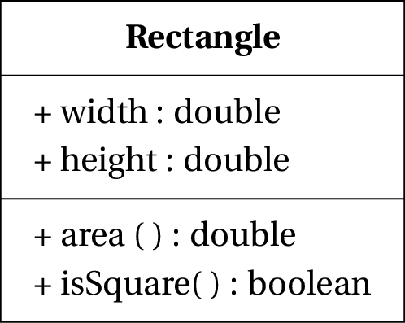
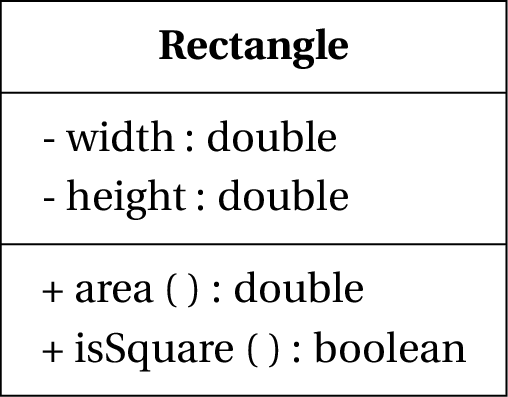
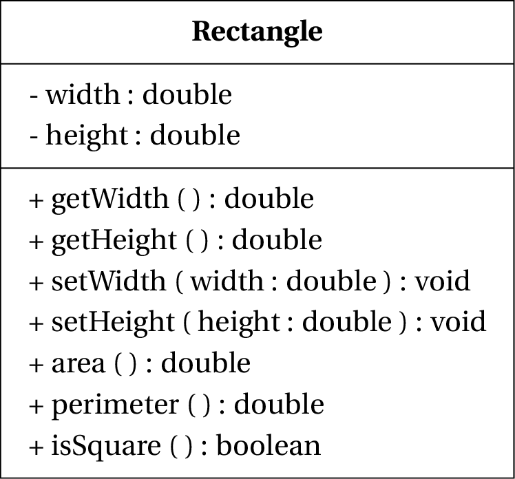
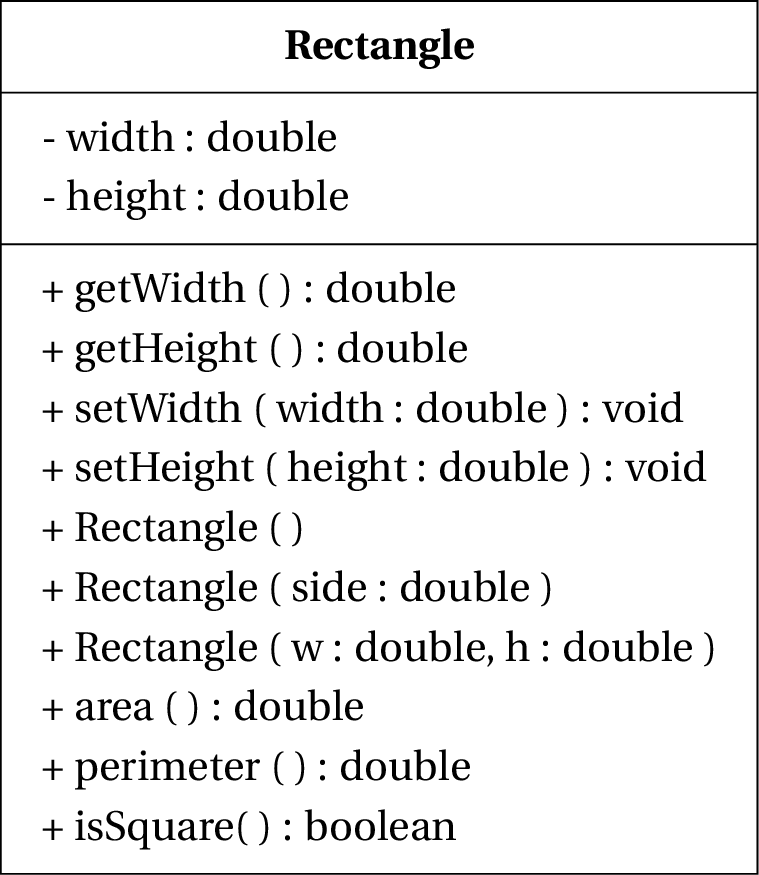
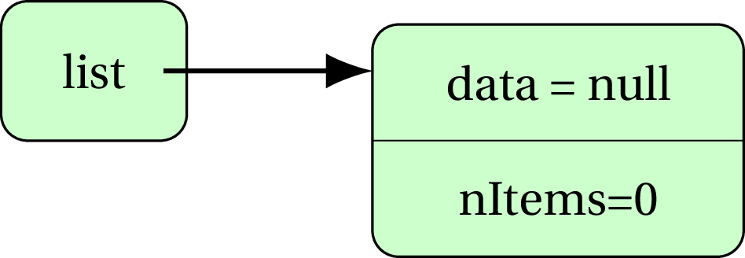
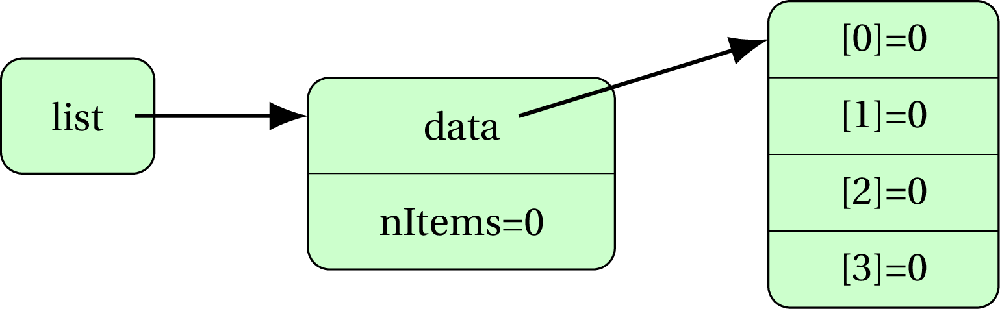

Introduction
============

Java is an object-oriented language. Classes and objects are one of the
key programming tools in Java. In this lecture we will cover some of the
basic concepts about classes and objects and how they are handled in
Java.

Object Oriented Programming – Brief Introduction
================================================

-   Classes are models of real world entities inside our programs.

-   Classes may have instance variables and methods. For example, a
    `Person` class can have a instance variable `name` of type `String`,
    and a method `eat()` of type `void`.

-   *OO Design* deals with designing the classes to solve a problem.

-   *OO Programming* deals with realising that design correctly.

Classes and instances
=====================

Class definition specifies -

-   instance variables each instance (object) of the class will have

-   methods, including instance methods that are called on instances/
    objects and class methods or static methods that are called on the
    class directly without invoking objects.

<p> &nbsp; </p>



<p> &nbsp; </p>

Example: Java’s String class
----------------------------

-   As we know `String` is a built in class for handling sequences of
    characters.

-   We can think of it as a Java type, just like `int`, `double`,
    `boolean`. (But String is a non-primitive type.)

-   Inside, it stores a sequence of characters (how, we don’t care right
    now).

-   The interface provides a number of operations on the character
    sequence.

Example: String object
----------------------

    String greeting = "Hello, World!";
    System.out.println(greeting.length());

Here, `greeting` is an instance, or, object of `String` class. The
statement `String greeting = Hello, World!;` is called the
**instantiation** statement. The class has an instance method `length`
that is being invoked on object `greeting`

Standard way of instantiatiation
--------------------------------

    String lecturer1 = "Gaurav";
    String lecturer2 = new String("Scott");

-   The two variables are different instances of the `String` class.

-   First is known as *lazy instantiation*, just for Strings.

-   Second (using `new`) is generally how we create instances. More
    information about this will come a bit later in this lecture <p> &nbsp; </p>

Class definition and instantiation
==================================

Defining classes
----------------

-   Each class is defined in a separate file with the same name and
    ending with `.java`

-   All Java class definitions are separate files in the same folder
    (for now).

Adding instance variables
-------------------------

Instance variables can be declared as in the following two examples.
Note the `public` modifier (for now):

     public int     instanceVar1;
     public String  instanceVar2;

Defining methods
----------------

Method definitions have a heading and a method body

-   The *heading* defines the name of the method and other useful
    information.

-   The *body* defines the code to be executed when the method is
    called.

Example - Defining a class
--------------------------

Defining a class: example Note that the above class definition merely
provides a template or blueprint for the class. No complete program
using this class has yet been written, and no object (instance) of this
class has yet been created.

<p> &nbsp; </p>



<p> &nbsp; </p>

[6][Define a class] Define a class for a Circle that is represented by
its radius.

    public class Circle {
        public double radius;
        /*
        * note that int is a wrong choice as radius 
        * CAN be a floating-point value like 1.5 or 2.4
        */
    }

Declaration and instantiation
-----------------------------

-   An object or instance of the new class type is declared in main as
    follows:

<!-- -->

    ClassName  classVar; //declaration
    Rectangle r; //example

<p> &nbsp; </p>


Declaration
-----------

Declaration creates a *reference* in the memory, which doesn’t refer to
any storage space yet.

Declaration and instantiation
-----------------------------

-   We perform the `instantiation` statement to allocate storage space
    for the instance variables of the object declared and to refer to
    that memory.

<!-- -->

    classVar = new ClassName(); //instantiation
    r = new Rectangle(); //example

<p> &nbsp; </p>



-   These can be combined:

        ClassName classVar = new ClassName(); 
        //declaration + instantiation

        Rectangle r = new Rectangle(); //example

[4][Declare and Instantiate an object] Declare and instantiate an object
`myCircle` of class `Circle`

    public class Client {
        public static void main(String[] args) {
            Circle myCircle = new Circle();
        }
    }

Although, you can just write the relevant part in written exams:

    Circle myCircle = new Circle();

Adding method to a class
------------------------

You can add methods inside the class that can be called on any
*instance* of the class.

<p> &nbsp; </p>



<p> &nbsp; </p>

The dot (.) operator
--------------------

The dot operator gives us access to the members (instance variables and
method) for an object. Think of it as the `apostrophe s (’s)` of the
human language (as in *“Gaurav’s class”* or *“Matt’s workshop”*)

      Rectangle r = new Rectangle(); //example
      r.width = 5;
      

-   The expression `r` gives us access to the instance variable `width`
    of object `r`.

-   When a method is invoked on an object using the dot operator, it
    calls the method as defined in the class **in the context** of that
    object and any instance variables used in that method are the ones
    belonging to that object.

<!-- -->

      Rectangle r = new Rectangle(); 
      r.width = 5;
      r.height = 8;
      System.out.println(r.area());
      

<p> &nbsp; </p>

Here, `r.area()` returns `width * height` and since the method is called
on object `r`, it returns `r.width * r.height`. Had the method been
called on another object `s`, it would return `s.width * s.height`.

[5][Access instance variables and call methods] Write a piece of code
that sits outside the class definition and displays the radius of the
object `myCircle` and also its area.

    System.out.println(myCircle.getRadius());
    System.out.println(myCircle.area());

Are there any default values?
-----------------------------

-   Each <span>*instance variables*</span> is automatically initialised
    to the default value for its type when an object of the class is
    created.

-   For example, an instance variable of type `int` is given the default
    value 0;

-   And an instance variable of type `String` (or any class type) is
    given the default value `null`. (More about `null` later.)

Getters and setters
===================

Bad client, bad bad client!
---------------------------

Once the object is created, we can start operating on it.

``` {style="buggy"}
Rectangle r = new Rectangle();
@r.width = -5;@ // :o :O
r.height = 8;
System.out.println(r.area()); 
//displays -40 :'(
```

Changing visibility to private
------------------------------

<p> &nbsp; </p>



<p> &nbsp; </p>

Now, the instance variables `width` and `height` are visible only within
the class definition.

How does one access (read/write) private instance variables
-----------------------------------------------------------

We access (read and write) private instance variables through public
methods called `getters` and `setters`.

-   `getters` return the value of the instance variable to the caller.

-   `setters` set the value supplied by the caller to the instance
    variables.

Setters must provide validation where applicable
------------------------------------------------

You can see that we validated the passed values before assigning to the
instance variable as `width = Math.abs(w)`. This is a typical case and
setters are in charge of validating data before assigning it to the
instance variables.

<p> &nbsp; </p>



<p> &nbsp; </p>

[8][Add getters and setters] Add getters and setters to class `Circle`.
The setter should result in radius becoming zero if the parameter passed
is not positive.

    //setter
    public void setRadius(double r) {
        if(r < 0)
            radius = 0;
        else
            radius = r;
    }

    //getter
    public double getRadius() {
        return radius;
    }

[6][Write a client] Write a client (code sitting outside `Circle.java`,
for example, in the `main` method of another class) that performs the
following operations,

-   Declare and instantiate object `myCircle` of class `Circle` that has
    a radius of 1.8

-   Display radius of `myCircle`.

-   Increase radius of `myCircle` by 1.4

<!-- -->

    public class Client {
        public static void main(String[] args) {
            Circle myCircle = new Circle();
            myCircle.setRadius(1.8);
            System.out.println(myCircle.getRadius());
            myCircle.setRadius(myCircle.getRadius() + 1.4);
            /* or you can split it up as:
            * double current = myCircle.getRadius();
            * double updated = current + 1.4;
            * myCircle.setRadius(updated);
            */
        }
    }

I wish creating objects was easier
----------------------------------

Let’s say that the user wants to create a `Rectangle` whose `width` is 5
and `height` is 8. Following code achieves this,

    Rectangle r = new Rectangle();
    r.width = 5;
    r.height = 8;

However, it would be really nice if one could pass the values for the
instance variables in the instantiation statement itself, as,

    Rectangle r = new Rectangle(5, 8);

This is done through `constructors`.

Constructors
============

-   A constructor is a method defined in the class.

-   A constructor must have the same name as the class.

-   A constructor has no return type (not even void).

-   There may be multiple constructors, each distinguished by its
    parameter list. Thus, we may have one constructor with no
    parameters, and another with one `int` parameter.

-   A suitable constructor is automatically called during instantiation
    based on number of parameters passed. If an appropriate constructor
    is not found, a compilation error is generated.

Example - Constructor
---------------------

    public class Rectangle {
        private double width, height;
        
        //getters and setters

        public Rectangle() { //default constructor
            setWidth(1);
            setHeight(1);
        }

        //parameterized constructor for a square
        public Rectangle(double side) { 
            setWidth(side);
            setHeight(side);
        }

        //parameterized constructor - generic
        public Rectangle(double w, double h) { 
            setWidth(w);
            setHeight(h);
        }
        //rest of the code
    }

<p> &nbsp; </p>



<p> &nbsp; </p>

Constructors should call setters - always!
------------------------------------------

**Constructors should always use setters to assign values to instance
variables.**

Default constructor
-------------------

It should be noted that a default constructor (without any parameters)
is pre-defined for you by Java and that’s why you can instantiate
objects without defining it yourself.

    Rectange r = new Rectangle();

The default constructor assigns the default values for the appropriate
data types to the instance variables. However, once you define a
parameterized constructor, the built-in default constructor is taken
away by Java. Thus, if you want to construct an object with default
initial values for the instance variables, you need to re-define that!

Defining the default constructor
--------------------------------

Let’s say the default `Rectangle` instance should be of unit length. We
can define the default constructor as,

    public Rectangle() {
        setLength(1);
        setBreadth(1);
    }

[8][Add default and parameterized constructor] Add two constructors to
the class `Circle`.

1.  No parameters passed (default constructor): Assigns the value 1.0 to
    radius <p> &nbsp; </p> through the setter.

2.  Parameter passed for radius (parameterized constructor): Assigns the
    passed value to radius through the setter.

<!-- -->

    //default constructor
    public Circle() {
        setRadius(1);
    }

    //parameterized constructor
    public Circle(double r) {
        setRadius(r); //let setter handle the validation
    }

Displaying objects
==================

Often we need to display the details of an object. For example, we might
need to display name and age of a Person object, or the details of a
Time object in the format `hours:minutes:seconds`, or in our example,
`width` and `height` of a `Rectangle` object. It is quite inconvenient
to display these details as,

    Rectangle r = new Rectangle(5, 8);
    System.out.println(r.width+`` by ''+r.height);

We *could* add a method `display` in the class `Rectangle` as,

    public void display() {
        System.out.println(width+`` by ''+height);
    }

And call this method on required object as,

    Rectangle r = new Rectangle(5, 8);
    r.display();

Problem with the `display()` method
-----------------------------------

But this would only let us **display** the object details, and not send
to a file, or concatenate with any other output.

Java provides a standard way to return the String description of an
object using the `toString()` method (with return type `String`).

Default `toString()` behaviour
------------------------------

When you display an object, what Java displays is the outcome of the
<span>toString()</span> method on that object

    Rectangle r = new Rectangle(1, 3);
    System.out.println(r); //something like [I@70dea4e

Java saw that you want to display a `Rectangle` object and replaced it
by the `toString()` method operating on that object as,

    System.out.println(r);
    //became
    System.out.println(r.toString()); 

Over-riding `toString()` behaviour
----------------------------------

We can over-ride `toString()` method as required. For the `Rectangle`
class,

    public String toString() {
        return width+`` by ''+height;
    }

When we display an object, it invokes the method `toString()` and
displays the value it returns.

    Rectangle r = new Rectangle(5, 8);
    System.out.println(r);
    /*
    automatically invokes r.toString() 
    and displays the value returned
    */

[5][Define toString method] Define the `toString` method in the `Circle`
class such that it displays the object details in the following format -

    Circle radius: <radius>, area: <area>

In a separate client, create a Circle object with radius 1.6 and display
it on the console.

    public String toString() {
        String result = "Circle radius: "+radius+", area: "+area();
        return result;
    }   

Class containing an array
=========================

In this unit, we’ll extensively see classes containing arrays.

We must remember that both arrays and objects are references and refer
to the memory holding the actual data (in the case of array, it’s the
array items, and in the case of objects, it’s the instance variables).

Take the following as an example (instance variables are `public` for
simplicity),

    public class DynamicArray {
        public int[] data;
        public int nItems;
    }

The client is as follows,

    public class Client {
        public static void main(String[] args) {
            DynamicArray list = new DynamicArray();
        }
    }

At this stage, the memory state looks like,

<p> &nbsp; </p>

If we change the values of the instance variables as,

    public class Client {
        public static void main(String[] args) {
            DynamicArray list = new DynamicArray();
            list.data = new int[4];
            list.nItems = 0;
        }
    }

It now becomes,

<p> &nbsp; </p>

 <p> &nbsp; </p>

Finally, we can modify the items of the array as,

    public class Client {
        public static void main(String[] args) {
            DynamicArray list = new DynamicArray();
            list.data = new int[4];
            list.data[0] = 5;
            list.data[1] = 12;
            list.nItems = 2;
        }
    }

This gives us, <p> &nbsp; </p> 
