](images/russiandoll.jpg)

Background
==========

Before we jump into the concept of recursive solutions and definition of
recursive methods, it’s critical that we understand how method calls
work.

We will use the following example to explain method calls:

    public class Client {
        public static void caller() {
            int a = 10, b = 5;
            boolean flag = callee(a+3, b*2);
        }
        
        public static boolean callee(int m, int n) {
            boolean result;
            if(m%2 == n%2) {
                result = true;
            }
            else {
                result = false;
            }
            return result;
        }
    }

1.  Any piece of code that we write is inside some method (besides
    declaring variables).

2.  When a piece of code inside one method (`caller`) calls another
    method (`callee`), the following things occurs,

    1.  The control transfers from `caller` to `callee`.

    2.  Actual parameters (`a+3, b*2` = `13,10`) passed are copied into
        the formal parameters (`m,n`).

    3.  An entry for `callee` with associated formal parameters and
        local variables is added on top of the `call stack`.

    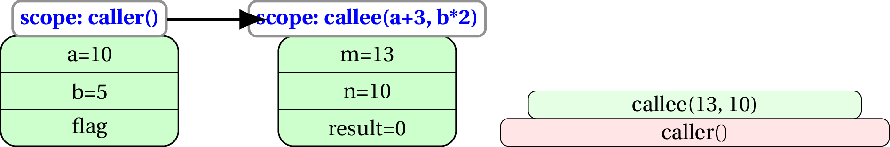

3.  The method `callee(13, 10)` terminates with a `return` statement (or
    when the last statement executes). The following happen when
    `callee` terminates,

    1.  The value returned (in case of non-void methods) replaces the
        method call. Thus `flag` inside `caller` becomes `false`.

    2.  The entry for `callee` is removed from the call stack. All
        formal parameters and local variables are destroyed.

    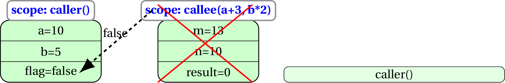

Overview
========

Recursion is the process of *reducing a problem into a simpler form of
itself*.

For example, $x^n$ (read as *$x$ to the power of $n$*) is defined as
$x * x * \cdots n$ times.

$$\begin{aligned}
x^n&=x * x * x \cdots n \text{times}\\
       &=[x * x * x \cdots (n-1) \text{times}] * x\\
       &=x^{n-1} * x\end{aligned}$$

If we were writing a method to compute $x^n$, how would we define it?

It needs the values for $x$ and $n$, and returns the result ($x^n$).

So something like:

    public static double power(double x, int n)

Now, the formula tells us that this method, when called with parameters
$x$ and $n$, should return $x^{n-1} * x$. So,

    public static double power(double x, int n) {
        return power(x, n-1) * x;
    }

But if we do this, our method calls (while computing $2^3$) will look
like,

-   power(2, 3) $\rightarrow$

-   power(2, 2) $\rightarrow$

-   power(2, 1) $\rightarrow$

-   power(2, 0) $\rightarrow$

-   power(2, -1) $\rightarrow$

-   $\cdots$ forever

Which means, at some stage we need to stop the method calls.

What do we know about the power operation?

If we reach $n=0$, we can return 1. This is called the termination step.

Our final method:

    public static double power(double x, int n) {
        if(n == 0) {
            return 1;
        }
        else {
            return power(x, n-1) * x;
        }
    }

Detailed example
================

    public class Client {
        public static void main(String[] args) {
            int a = 4;
            int b = sum(a);
        }
        
        public static int sum(int n) {
            if(n == 0) {
                return 0;
            }
            int result = n + sum(n-1);
            return result;
        }
    }

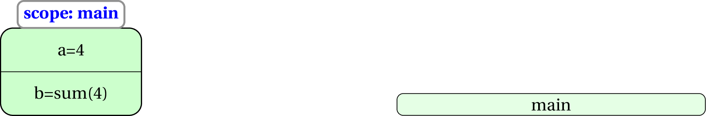 
 &nbsp; 

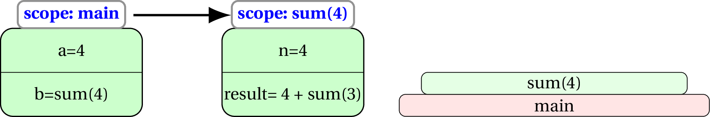

 &nbsp; 

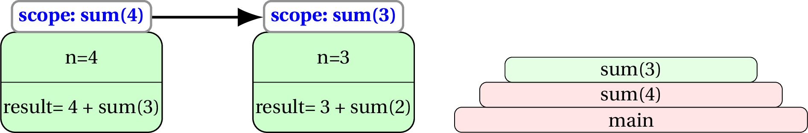

 &nbsp; 

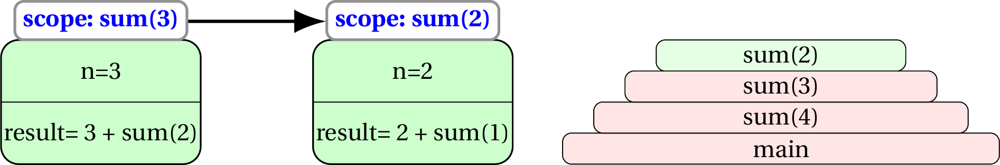

 &nbsp; 

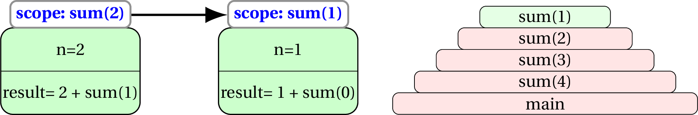

 &nbsp; 

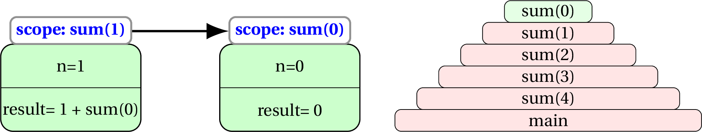

 &nbsp; 

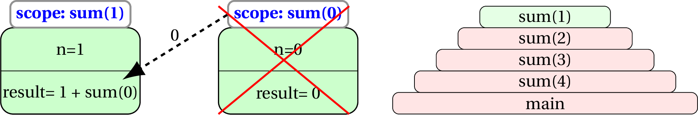

 &nbsp; 

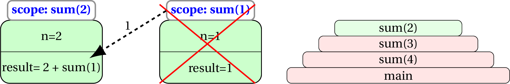

 &nbsp; 

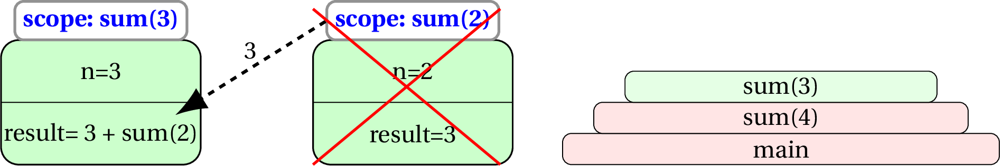

 &nbsp; 

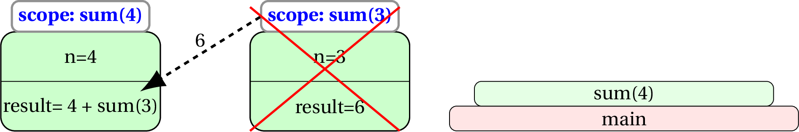

 &nbsp; 

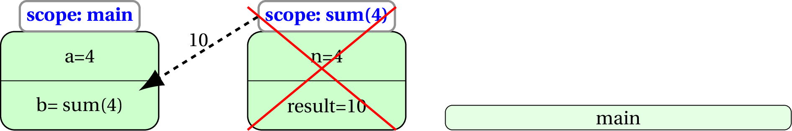

 &nbsp; 

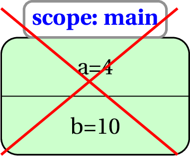

Tracing some more recursive code
================================

[6] Trace the call to recursive method `foo`

    public class Client {
        public static void main(String[] args) {
            int a = 8327;
            int b = foo(a);
        }
        
        public static int foo(int n) {
            if(n==0) {
                return 0;
            }
            int result = n%10 + sum(n/10);
            return result;
        }
    }

    foo(8327) = 7 + foo(832)
    foo(832) = 2 + foo(83)
    foo(83) = 3 + foo(8)
    foo(8) = 8 + foo(0)
    foo(0) = 0
    Therefore,
    foo(8) = 8 + 0 = 8
    foo(83) = 3 + 8 = 11
    foo(832) = 2 + 11 = 13
    foo(8327) = 7 + 13 = 20
    b = 20  

[6] Trace the call to recursive method `foo`

    public class Client {
        public static void main(String[] args) {
            int a = 42, b = 140;
            int c = foo(a, b);
        }
        
        public static int foo(int n) {
            if(b==0) {
                return a;
            }
            int result = foo(b, a%b);
            return result;
        }
    }

    foo(42, 140) = foo(140, 42)
    foo(140, 42) = foo(42, 14)
    foo(42, 14) = foo(14, 0)
    foo(14, 0) = 14
    Therefore,
    foo(42, 14) = 14
    foo(140, 42) = 14
    foo(42, 140) = 14
    c = 14

Recursion with Strings
======================

Recursive solutions can be very useful when working with Strings.

For example, if you want to reverse a String, you can reverse all but
the first character and then append the first character at the end of
that.

    public static String reverse(String s) {
        if(s.length() < 2) {
            return s;
        }
        char first = s.charAt(0);
        String rest = s.substring(1);
        return reverse(rest) + first;
    }

Once you have the method `reverse`, checking if a String is a palindrome
(same when reversed) or not is a breeze.

    public static boolean isPalindrome(String s) {
        if(s.length() < 2) {
            return true;
        }
        return s.equals(reverse(s));
    }

Actually useful recursion
=========================

The examples that we saw so far are pedagogical in nature, that is, they
are easy to understand. However, they are not very useful in real life
as the same thing can be done without using recursion (using an
*iterative* solution).

However, recursion **is** very powerful as explained in the following
problem and its (recursive) solution.

The Problem
-----------

Given an integer array (`arr`) and another integer (`target`), finding
out whether some items of `arr` add up to `target` or not.

-   For every item in the array (`arr[i])`, either the item is a part of
    the subset that adds up to the target, or its not.

-   If that item **is** a part of the subset adding up to the `target`,
    we need to check if the rest of the array adds up to
    `target - arr[i]`

-   If that item is **not** a part of the subset adding up to the
    `target`, we need to check if the rest of the array adds up to
    `target`

-   But how do we tell the method that we want to look through **the
    rest of the** array? By passing a starting index.

-   If that index reaches `arr.length` and we haven’t successfully
    *constructed* `target`, we can return `false`

<!-- -->

    public static boolean addUpTo(int[] arr, int target, int start) {
        if(target == 0) {
            return true;
        }
        
        if(start == arr.length) {
            return false;
        }
        //can target can be constructed with arr[start]?
        if(addUpTo(arr, target - arr[start], start + 1)) {
            return true;
        }
        //can target can be constructed without arr[start]?
        if(addUpTo(arr, target, start + 1)) {
            return true;
        }
        return false;
    }

The beauty about the method is that all the current method call needs to
do is explore two options,

-   to use the current item, or,

-   not (to use the current item)

and the the delegate method call will worry about the rest.
