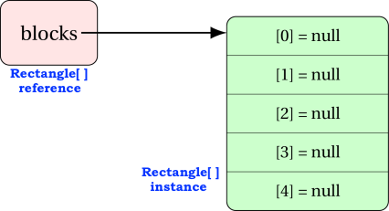
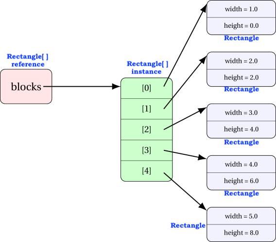

<details class="prereq" markdown="1"><summary>Assumed Knowledge:</summary>

  * [Classes as Types](./classes_types.html)
  * [Copying objects](./classes_copies.html)
  * [Instance methods](./classes_methods.html)

</details>

<details class="outcomes" markdown="1"><summary>Learning Outcomes:</summary>

  * Creating and operating on an array of objects.

</details>

## Author: Gaurav Gupta

# Array of objects

## Class under consideration

We will use the following class for this discussion:

```java
public class Rectangle {
	public double width, height;

	public Rectangle(double w, double h) {
		width = w;
		height = h;
	}

	public String toString() {
		return width + " by " + height;
	}
}
```

## Creating an array of objects

#### STEP 1 - Instantiate the array

```java
public class Client {
	public static void main(String[] args) {
		Rectangle[] blocks = new Rectangle[5];
	}
}
```

You can go through each item of the array and display it.

```java
for(int i=0; i < blocks.length; i++) {
	System.out.println(blocks[i]);
}
```

You'll get the following output:

```
null
null
null
null
null
```

Each item of the array is a `Rectangle` reference, and initialized to the default value (which, for objects, is `null`).

The memory diagram for the current state of the array is



Any attempt to access an instance variable or instance method on any of the items of the array will raise a `NullPointerException`.

```java
blocks[0].width = 5; //NullPointerException
String str = blocks[0].toString(); //NullPointerException
```

## Hence...

#### STEP 2 - Instantiating each object

```java
for(int i=0; i < blocks.length; i++) {
	blocks[i] = new Rectangle(i+1, i*2); //instantiate item at index i
	System.out.println(blocks[i]); //display it
}
```



This time, you will get the following output:

```
1.0 by 0.0
2.0 by 2.0
3.0 by 4.0
4.0 by 6.0
5.0 by 8.0
```

## Exercise: Creating (filtered) deep copy of an object array

Consider the array `source` populated as:

```java
Rectangle[] source = new Rectangle[20];
for(int i=0; i < source.length; i++) {
	double randWidth = 1 + rand.nextInt(5);
	double randHeight = 1 + rand.nextInt(5);
	source[i] = new Rectangle(randWidth, randHeight);
}
```

Create a second array containing Rectangles that have an area of 10 or more.

#### STEP 1: Count the number of rectangles with area of 10 or more

```java
int count = 0;
for(int i=0; i < source.length; i++) {
	if(source[i].area() >= 10) {
		count++;
	}
}
```

#### STEP 2: Create an array of required size

```java
Rectangle[] bigRectangles = new Rectangle[count];
```

#### STEP 3: Populate the array

```java
int destIndex = 0;
for(int i=0; i < source.length; i++) {
	if(source[i].area() >= 10) {
		bigRectangles[destIndex] = source[i];
		destIndex++;
	}
}
```

> ## Given an array `data` of `Rectangle` objects, create an array `wider` with those rectangles whose width is more than their height
>> ## SOLUTION
```java
int count = 0;
for(int i=0; i < data.length; i++) {
	if(data[i].width > data[i].height) {
		count++;
	}
}
Rectangle[] wider = new Rectangle[count];
int destIndex = 0;
for(int i=0; i < data.length; i++) {
	if(data[i].width > data[i].height) {
		wider[destIndex] = data[i];
		destIndex++;
	}
}
```

You can also access an instance variable or instance method on any of the items of the array.

```java
blocks[0].width = 5; //change the width of the first item to 5
int h = blocks[3].height; //store height of fourth item into h
```

Complete code is provided in [ArrayOfObjects.java](./codes/ArrayOfObjects.java)
