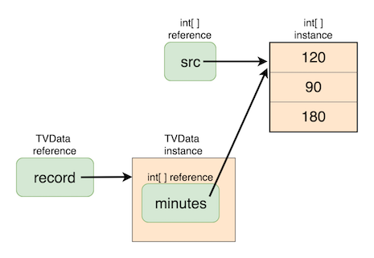
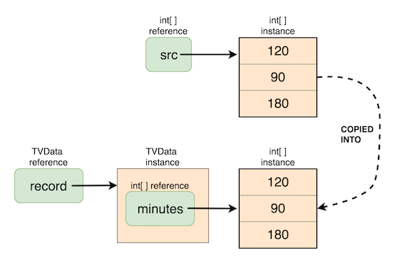
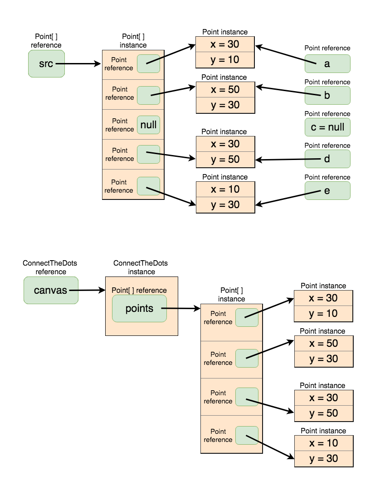

<details class="prereq" markdown="1"><summary>Assumed Knowledge:</summary>

  * [Classes as Types](./classes_types.html)
  * [Copying objects](./classes_copies.html)
  * [Instance methods](./classes_methods.html)
  * [Composition](./classes_composition.html)
</details>

<details class="outcomes" markdown="1"><summary>Learning Outcomes:</summary>

  * Defining a class holding array(s).
  * Creating and populating objects of such classes.
  
</details>

## Author: Gaurav Gupta

# Class holding array(s)

Say, we want to keep a track of the total time spent daily watching television.

The dataset would be something like:

- **Day 1**: 120 minutes
- **Day 2**: 90 minutes
- **Day 3**: 180 minutes
- ...

If we hold this information in an array, it's rather primitive and lacks context. However, if we hold it in an array **inside** a class, we can create instance methods to operate and analyze the dataset, and also provide context and meaning to our objects.

```java
public class TVData {
	public int[] minutes;
}
```

Before we go on and add constructors and other methods, let's think about how we are going to access the information.

From inside a client (outside the class definition), assuming an object `record` of class `TVData`, 

- the array holding the information is accessed using `record.minutesWatched`.
- the number of days for which we have the information is given by `record.minutes.length`.
- amount of time I spent watching TV on the first day is given by `record.minutes[0]`.
- amount of time I spent watching TV on the second day is given by `record.minutes[1]`.
- and so on ...

Next, we add a constructor with an array passed that will be **reference-copied** into the array `minutes`, and a method that determines total viewing time.

```java
public class TVData {
	public int[] minutes;
	
	public TVData(int[] source) {
		minutes = source; //reference copy made into array
	}
	
	public int totalViewingTime() {
		int result = 0;
		for(int i=0; i < minutes.length; i++) {
			result+=minutes[i];
		}
		return result;
	}
}
```

The following client gives an example of how the object will be created and used:

```java
public class GoodClient {
	public static void main(String[] args) {
		int[] src = {120, 90, 180};
		TVData record = new TVData(src); //populate with array src
		int total = record.totalViewingTime();
		System.out.println(total+" minutes viewed");
	}
}
```


The above client would give the expected outcome:

```
390 minutes viewed
```

## However ...

What happens when we change the contents of the source data AFTER populating our object with it?

```java
public class BadClient {
	public static void main(String[] args) {
		int[] src = {120, 90, 180};
		TVData record = new TVData(src); //populate with array src
		
		//so far, so good
		
		src[0] = -400; //nothing stops us from doing so
		
		int total = record.totalViewingTime();
		System.out.println(total+" minutes viewed");
	}
}
```

The above client would give the following outcome, which is, let's say, logically flawed:

```
-130 minutes viewed
```

We don't want the array held inside an object to be a reference copy of the source, but an instance copy.

Everything else remains the same, but we change the constructor as follows,

```java
public TVData(int[] source) {
	if(source == null) {
		minutes = new int[0]; //empty array
	}
	else {
		minutes = new int[source.length];
		for(int i=0; i < source.length; i++) {
			minutes[i] = Math.max(0, source[i]); //some more validation
		}
	}
}
```




Now, both `GoodClient` and `BadClient` will give the same, logically correct, output:

```
390 minutes viewed
```

# Class holding an array of objects

This section assumes you are familiar with [Composition](./classes_composition.html).

For the sake of clarity, we'll use the same `Point` class definition used in that topic.

```java
public class Point {
	public int x, y;
	
	public Point(int x, int y) {
		this.x = x; //"this" distinguishes instance variable from formal paramter
		this.y = y;
	}
	
	public Point(Point p) {
		x = p.x;
		y = p.y;
	}
	
	public String toString() {
		return "("+x+","+y+")";
	}
}
```

Say we want to create a "connect-the-dots" game where multiple points are present on a canvas and adjacent points need to be connected to reveal the art. 

### Iteration 1

```java
public class ConnectTheDots {
	public Point[] points;
	
	public ConnectTheDots(Point[] source) {
		if(source == null) {	
			points = new Point[0];
		}
		else {
			points = new Point[source.length];
			for(int i=0; i < points.length; i++) {
				points[i] = source[i];
			}
		}
	}
}
```

There is one logical mistake in the above code. 

<details>
  <summary>Click to reveal!</summary>
  Each item of the array is a reference copy of the corresponding item in `source`.
</details>

### Iteration 2

```java
public class ConnectTheDots {
	public Point[] points;
	
	public ConnectTheDots(Point[] source) {
		if(source == null) {	
			points = new Point[0];
		}
		else {
			points = new Point[source.length];
			for(int i=0; i < points.length; i++) {
				points[i] = new Point(source[i]);
			}
		}
	}
}
```

Still one issue :( 

<details>
  <summary>Click to reveal!</summary>
  If an item in `source` is `null`, the constructor call will raise `NullPointerException`.
</details>

### Iteration 3 (and the last one)

```java
public class ConnectTheDots {
	public Point[] points;
	
	public ConnectTheDots(Point[] source) {
		if(source == null) {	
			points = new Point[0];
		}
		else {
			int nonNullPoints = 0;
			
			for(int i=0; i < source.length; i++) {
				if(source[i] != null) {
					nonNullPoints++;
				}
			}
			
			points = new Point[nonNullPoints];
			
			int k = 0; //destination index
			for(int i=0; i < source.length; i++) {
				if(source[i] != null) {
					points[k] = new Point(source[i]);
					k++;
				}
			}
		}
	}
}
```




Let's just write a client to finish this off!

```java
import java.util.Arrays;

public class ArtGallery {
	public static void main(String[] args) {
		Point a = new Point(30, 10);
		Point b = new Point(50, 30);
		Point c = null; //BOO!!!!!!!
		Point d = new Point(30, 50);
		Point e = new Point(10, 30);
		Point[] src = {a, b, c, d, e};
		ConnectTheDots canvas = new ConnectTheDots(src);
		System.out.println(Arrays.toString(canvas.points));
	}
}
```

We will get the following output (notice that the `null` object was dropped successfully):

```
[(30,10), (50,30), (30,50), (10,30)]
```

Complete code is provided in [ArtGallery.java](./codes/ArtGallery.java)
			


