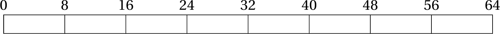
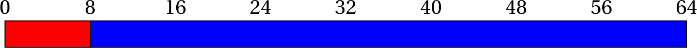
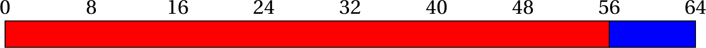
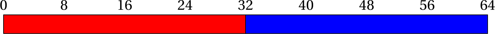
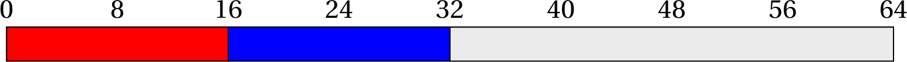
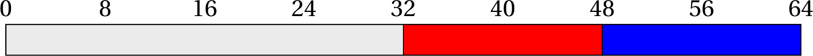
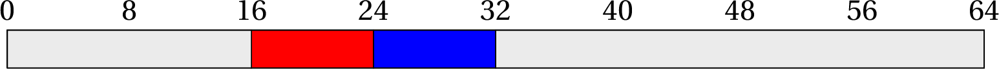
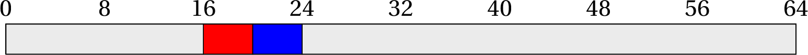
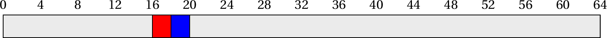

Overview
========


We explore the two standard searching algorithms, along with analysis of
the two.

Why is searching important?
---------------------------

Searching for *something* is one of the most fundamental operations on
which more complex algorithms are based. Consider some of the following
real-life scenarios,

-   Check if a particular student is enrolled in a unit.

-   Check if there are any items between a certain price range in the
    bill.

-   Compute the number of debit transactions over a certain amount in
    your monthly credit card statement.

-   Determine a mutually suitable time for a meeting between 2 people
    (and more broadly $n$ people) based on their calendars.

-   Determine the number of public holidays on a Friday/Monday (Yes!)

-   Find the number of rows in a spreadsheet that have a keyword in it.

-   Find the number of rows in a spreadsheet that have any one of $n$
    keywords in it.

-   Find the number of rows in a spreadsheet that have every one of $n$
    keywords in it.

All these problems rely on searching through some data set.

So, it’s really very simple! You need searching to become good at
algorithms that build on top of it.

Linear search
=============

Version 1
---------

-   Simplest search algorithm.

-   Look at each element of the array in turn.

-   If you find the target, stop.

-   If you don’t find the target by the end, it’s not there.

<!-- -->

    /**
     * Perform a linear search for a given integer in the array.
     * @return true if target present, false otherwise
     */
    public static boolean linearSearch(int[] arr, int target) {
       for( int i=0; i<arr.length; i++ ) {
          if (arr[i] == target) {
             return true;
          } else {
             return false;
          }
       }
    }

Trace the above code with the following pair of values:

-   `arr = {1, 7, 2, 9}, target = 1`

-   `arr = {1, 7, 2, 9}, target = 8`

-   `arr = {1, 7, 2, 9}, target = 9`

When `target = 1`, the first item (1) matches the target and the method
returns `true` correctly.

When `target = 8`, the first item (1) **DOES NOT** match the target and
the method immediately returns `false` - which is incidentally correct.

When `target = 9`, the first item (1) **DOES NOT** match the target and
the method immediately returns `false` - .

You can see the problem is the `else` block. The code returns `false` as
soon as an item doesn’t match the target.

So, if the target exists in the array at any index other than 0, the
method incorrectly returns `false`.

[8][Debug linear search] Write a corrected version of the linear search
code from above.

public static boolean linearSearch(int[] arr, int target) <span> for(
int i=0; i\<arr.length; i++ ) <span> if (arr[i] == target) <span> return
true; </span> </span> return false; </span>

[8][Analyze linear search performance] Consider an array
`arr = {1, 2, \cdots, n}` (such that `arr.length = n`). How many times
is the loop executed in the linear search code to search for,

-   `target = 1`

-   `target = n/2`

-   `target = n + 1`

-   `target = 1: 1 time`

-   `target = n/2: n/2 times`

-   `target = n + 1: n times`

What information did you deduce from the above exercise?

-   In the best case scenario (fastest possible), the loop executes just
    once (irrespective of the value of $n$)

-   In the worst case scenario (slowest possible), the loop executes $n$
    times. Thus, the time taken is proportional to $n$ (as time is
    proportional to number of loop executions and number of loop
    executions is proportional to $n$).

Version 2
---------

[8][Code for linear search - version 2] Write a method in java that
implements the pseudo-code from Algorithm [lsv2]

[H] set `idx` to first item’s index (0 in java) set `result` to `false`
return `result`

    public static boolean linearSearchV2(int[] arr, int target) {
        boolean result = false;
        for(int i=0; i < arr.length; i++) {
            if(arr[i] == target) {
                result = true;
            }
        }
        return result;
    }

[8][Analysis of linear search - version 2] Consider an array
`arr = {1, 2, \cdots, n}` (such that `arr.length = n`). How many times
is the loop executed in linear search - version 2 code to search for,

-   `target = 1`

-   `target = n/2`

-   `target = n + 1`

-   `target = 1: n times`

-   `target = n/2: n times`

-   `target = n + 1: n times`

Comparison of versions 1 and 2
------------------------------

[5][Comparison of versions 1 and 2] Which version is better - 1 or 2?

The loop in both versions executes $n$ times in the worst case scenario,
but in the best case scenario, version 1 loop executes only once
(compared to $n$ executions of the loop in version 2). Therefore,

Returning index instead of true/false
-------------------------------------

Returning `true` if an item is found in an array (and `false` otherwise)
is fine, but returning the index at which it is found (and -1 if it
isn’t) is even better!

[8][Modify linear search to return index] Write a method that when
passed,

-   an integer array `arr`

-   an integer `target`

returns,

-   the first index in `arr` at which `target` exists

-   -1 if `target` is not found in `arr`

public static int linearSearch(int[] arr, int target) <span> for(int
i=0; i \< arr.length; i++) <span> if(arr[i] == target) <span> return i;
</span> </span> return -1; </span>

Handling `null` array
---------------------

Since we’ll be dealing with arrays and other containers throughout this
unit, it’s important to think about the scenario where a `null` array or
object is passed to a method.

The code that we wrote will raise a `NullPointerException` because we’d
be accessing `arr.length` for a `null` array. This is no good. We must
handle a `null` array scenario before accessing the array.

The course of action is dependent on the problem.

[5][Handling `null` array] What value should we return if a `null` array
is passed to a linear search algorithm, and why?

The method should return -1 if you try to search for an item in a `null`
array, since -1 is not a valid index, hence it is a clear error code
indicating that the array was `null`.

Variation 1
-----------

[8][Returning number of occurrences of an item] Write a method that
returns the number of times an integer `target` exists in an integer
array `arr`. Return 0 if `target` doesn’t exist in `arr`. Handle the
`null` array scenario (think about what value should be returned in
`arr = null`.

Perform an analysis of how many times the iterating loop executes in the
best and worst cases.

    public static int count(int[] arr, int target) {
        if(arr == null)
            return 0; //a null array has 0 occurrences of any item
        int count = 0;
        for(int i=0; i < arr.length; i++) {
            if(arr[i] == target) {
                count++;
            }
        }
        return count;
    }

Variation 2
-----------

[8][Returning index of the last occurrence of an item] Write a method
that returns the last index at which an integer `target` exists in an
integer array `arr`. Return -1 if no such item is found. Handle the
`null` array scenario (think about what value should be returned in
`arr = null`.

Perform an analysis of how many times the iterating loop executes in the
best and worst cases.

Version 1 (slow in best case scenario)

    public static int lastIndexOf(int[] arr, int target) {
        if(arr == null)
            return -1;
        int result = -1;
        for(int i=0; i < arr.length; i++) {
            if(arr[i] == target) {
                result = i; //over-write earlier index with later index
            }
        }
        return result;
    }

Best case: n times Worst case: n times Version 2 (faster in best case
scenario)

    public static int lastIndexOf(int[] arr, int target) {
        if(arr == null)
            return -1;
        for(int i=arr.length - 1; i >= 0; i--) {
            if(arr[i] == target) {
                return i;
            }
        }
        return -1;
    }

Best case: 1 time Worst case: n times

Variation 3
-----------

[8][Returning index of an item in a given range] Write a method, that
when passed three values, `int[] arr, int low, int high`, returns the
first index at which an item in the range $[low, high]$ (including both
`low` and `high`) exists in an integer array `arr`. Return -1 if no such
item is found. Handle the `null` array scenario (think about what value
should be returned in `arr = null`.

Perform an analysis of how many times the iterating loop executes in the
best and worst cases.

Version 1 (slow in best case scenario)

    public static int indexOf(int[] arr, int low, int high) {
        if(arr == null)
            return -1;
        for(int i=0; i < arr.length; i++) {
            if(arr[i] >= low && arr[i] <= high) {
                return i;
            }
        }
        return -1;
    }

Best case: 1 time Worst case: n times

Variation 4
-----------

[8][Returning first positive item after a negative item] Write a method,
that when passed an integer array, returns the first index at which a
positive item (more than 0) exists such that the previous item is a
negative item (less than 0). Return -1 if no such item is found. Handle
the `null` array scenario (think about what value should be returned in
`arr = null`.

Perform an analysis of how many times the iterating loop executes in the
best and worst cases.

Version 1 (slow in best case scenario)

    public static int indexOfPosAfterNeg(int[] arr) {
        if(arr == null)
            return -1;
        for(int i=1; i < arr.length; i++) { //IMPORTANT: start from index 1
            if(arr[i] > 0 && arr[i-1] < 0) {
                return i;
            }
        }
        return -1;
    }

Best case: 1 time Worst case: n times

Binary search
=============

Let’s play a game.

Player 1 thinks of a number between 0 and 64. 




Player 2 guesses the number such that after each guess, player 1 has to
say,

-   Bingo! If the guess is correct

-   Higher. If guess is more than the number thought

-   Lower. If guess is less than the number thought

What would be your guesses? And why?

Hypothetically, if the first guess is 8, then, the following scenarios
(along with their probabilities) occur,

-   Bingo! (1/65)

-   Lower. (8/65)

-   Higher. (56/65)



On the other hand, if the first guess is 56, then, the following
scenarios (along with their probabilities) occur,

-   Bingo! (1/65)

-   Lower. (56/65)

-   Higher. (8/65)



if the first guess is 32, then, then we have,

-   Bingo! (1/65)

-   Lower. (32/65)

-   Higher. (32/65)



This is a *balanced* outcome as we approximately **halve** the search
space with every guess.

Let’s look at the *hits* after each iteration. We have already seen that
if `target = 32`, we get a hit after the first *balanced* guess (32)
itself.

If not, there are two scenarios:

1.  `target` is either less than 32. The second guess should be 15
    (integer mid-point of 0 and 31).

    

2.  `target` is more than the first guess. The second guess should be 48
    (integer mid-point of 33 and 64)

    

A trace of progression when `target = 17` is given below:

Guess 1: 32 

 Feedback: Lower

Guess 2: 16 

 Feedback: Higher

Guess 3: 24 

 Feedback: Lower

Guess 4: 20 

 Feedback: Lower

Guess 5: 18 

 Feedback: Lower

Guess 6: 17 

 Feedback:

Thus, in the worst case for 64 numbers, we need 6 guesses.

If we had 128 numbers to start with instead of 64, the first guess would
reduce the search space to 64.

Thus, in the worst case for 128 numbers, we need 7 guesses.

By the same logic, we can reach the following table:

If $n = 2^k$, then $k = log_2(n)$ (read as *“k is log n base 2”*).\
More generally, if $n = b^k$, then $k = log_b(n)$.

The number of iterations required to guess a number from a range of size
$n$ when feedback is provided is $log_2(n)$.

Formal discussion on binary search
----------------------------------

The key in the game we played above is the feedback the guesser gets.
Without that we can’t split the search space in half. Similarly, if we
are to use binary search on an integer array, **it must be sorted**.

It doesn’t matter if it’s sorted in ascending order or descending, as we
can tweak the algorithm accordingly.

The pseudo-code for binary search algorithm is given below:

[H] set `first` to first item’s index (0 in java) set `last` to last
item’s index (arr.length - 1 in java) return -1 //first \> last implies
no match

[5][Binary search - descending order] Tweak binary search algorithm to
use on array sorted in **descending** order. Re-write only those lines
that need to be modified. The fewer changes, the better!

Line 8: Change \< (less) to \> (more). That way larger items are
searched in left half and smaller items in right half.

Binary search code
------------------

Following is a code for binary search in Java (with comments).

``` {style="junit"}
/**
* @param arr: array in which item should be searched.
* if not null, arr is assumed to be sorted in ascending order
* @param target: item to be searched
* @return index at which target exists in arr, 
* -1 if target doe not exist in arr
*/
public static int binarySearch(double[] arr, double target) {
    if(arr == null) {
        return -1;
    int first = 0; //left boundary of search space
    int last = arr.length - 1; //right boundary of search space
    while(first <= last) { //search space not exhausted
        int median = (first+last)/2; //mid-point
        if(target == arr[median])
            return median; //return index where target found
        if(target < arr[median])
            last = median - 1; //search in left half
        else
            first = median + 1; //search in right half
    }
    //loops exists means search space exhausted
    return -1;  
}
```

[1][Trace execution of binary search] Trace the execution of the above
code for,

    arr = {0, 0, 0, 2, 5, 54, 54, 56, 65, 68, 68, 69, 72, 82, 90, 120}  

and target =

1.  54

    <span>p<span>1cm</span>|p<span>1cm</span>|p<span>2cm</span>|p<span>1.5cm</span>|p<span>2.5cm</span>|
    p<span>4cm</span></span> first & last & first $\leq$ last & median &
    arr[median] & target ? arr[median] (== or \< or \>)\
    & & & & &\
    & & & & &\
    & & & & &\
    & & & & &\
    & & & & &\
    & & & & &\

2.  42

    <span>p<span>1cm</span>|p<span>1cm</span>|p<span>2cm</span>|p<span>1.5cm</span>|p<span>2.5cm</span>|
    p<span>4cm</span></span> first & last & first $\leq$ last & median &
    arr[median] & target ? arr[median] (== or \< or \>)\
    & & & & &\
    & & & & &\
    & & & & &\
    & & & & &\
    & & & & &\
    & & & & &\

3.  120

    <span>p<span>1cm</span>|p<span>1cm</span>|p<span>2cm</span>|p<span>1.5cm</span>|p<span>2.5cm</span>|
    p<span>4cm</span></span> first & last & first $\leq$ last & median &
    arr[median] & target ? arr[median] (== or \< or \>)\
    & & & & &\
    & & & & &\
    & & & & &\
    & & & & &\
    & & & & &\
    & & & & &\

1.  54

    <span>p<span>1cm</span>|p<span>1cm</span>|p<span>2cm</span>|p<span>1.5cm</span>|p<span>2.5cm</span>|
    p<span>4cm</span></span> first & last & first $\leq$ last & median &
    arr[median] & target ? arr[median] (== or \< or \>)\
    0 & 15 & true & 7 & 56 & 54 \< 56\
    0 & 6 & true & 3 & 2 & 54 \> 2\
    4 & 6 & true & 5 & 54 & 54 == 54\

2.  42

    <span>p<span>1cm</span>|p<span>1cm</span>|p<span>2cm</span>|p<span>1.5cm</span>|p<span>2.5cm</span>|
    p<span>4cm</span></span> first & last & first $\leq$ last & median &
    arr[median] & target ? arr[median] (== or \< or \>)\
    0 & 15 & true & 7 & 56 & 42 \< 56\
    0 & 6 & true & 3 & 2 & 42 \> 2\
    4 & 6 & true & 5 & 54 & 42 \< 54\
    4 & 4 & true & 7 & 56 & 42 \> 5\
    5 & 4 & false & & &\

3.  120

    <span>p<span>1cm</span>|p<span>1cm</span>|p<span>2cm</span>|p<span>1.5cm</span>|p<span>2.5cm</span>|
    p<span>4cm</span></span> first & last & first $\leq$ last & median &
    arr[median] & target ? arr[median] (== or \< or \>)\
    0 & 15 & true & 7 & 56 & 120 \> 56\
    8 & 15 & true & 11 & 69 & 120 \> 69\
    12 & 15 & true & 13 & 82 & 120 \> 82\
    14 & 15 & true & 14 & 90 & 120 \> 90\
    15 & 15 & true & 15 & 120 & 120 == 90\

[8][Analysis of Binary Search] What are the best case and worst case
scenarios for binary search and for each scenario, how many times is the
loop executed?

-   Best case scenario: Item at the first median. Number of loop
    executions: 1

-   Worst case scenario: Item not present in the array. Number of loop
    executions (for an array of size $n$): $log_2(n)$.

p<span>1cm</span>|
