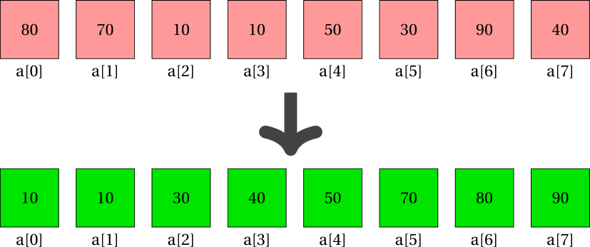

Overview
========


We explore the two standard sorting algorithms - insertion, and
selection, along with analysis of the two. In addition, we also take a
less detailed look at merge sort.

Why is sorting important?
-------------------------

Sorting a collection makes it easy to analyse data. Several tasks are
made simpler if a collection is sorted, such as:

-   finding the lowest value (first value in a collection sorted in
    ascending order)

-   finding the highest value (last value in a collection sorted in
    ascending order)

-   finding the median value (item at `arr.length/2`)

-   checking if the array contains any negative value (it does if the
    lowest value is less than zero)

-   checking if the array contains only negative value (it does if the
    highest value is less than zero)

-   faster search (using binary search algorithm)



Selection Sort
==============

The principle behind selection sort is:

* Swap the smallest item in the unsorted part of the array with the
first item of the unsorted part of the array*


Selection Sort sample pseudo-code
---------------------------------

[H] set `i` to 0

Selection Sort sample source code
---------------------------------

    //helper 1
    public static void swap(int[] a, int idx1, int idx2) {
        if(a == null) nothing to do 
            return;
        if(idx1 < 0 || idx1 >= a.length) //invalid index 1
            return;
        if(idx2 < 0 || idx2 >= a.length) //invalid index 2
            return;
        int temp = a[idx1];
        a[idx1] = a[idx2];
        a[idx2] = temp;
    }

    //helper 2
    public static int indexSmallestItem(int[] a, int start) {
        if(a == null) 
            return -1; //error code
        if(start < 0 || start >= a.length) //invalid index
            return -1;
        int result = start; 
        for(int k=start+1; k < a.length; k++) {
            if(a[k] < a[result]) {
                result = k;
            }
        }
        return result;
    }

    //sorting method
    public static void selectionSort(int[] arr) {
        if(arr == null) //nothing to do
            return;
        for(int i=0; i < arr.length - 1; i++) {
            int minIndex = indexSmallestItem(arr, i);   
            swap(arr, i, minIndex);
        }
    }

The helpers can be written inline as well, with which the method is:

        //sorting method
    public static void selectionSort(int[] arr) {
        if(arr == null) //nothing to do
            return;
        for(int i=0; i < arr.length - 1; i++) {
            int minIndex = i;
            for(int k=i+1; k < arr.length; k++) {
                if(arr[k] < arr[minIndex]) {
                    minIndex = k;
                }
            }
            int temp = arr[i];
            arr[i] = arr[minIndex];
            arr[minIndex] = temp;
        }
    }

[8][Trace selection sort execution] Trace the status of the array at the
end of each iteration of the loop controlled by variable `i` in
selection sort for the following cases:

1.  `arr = {4, 3, 6, 5, 2, 1}`

2.  `arr = {1, 8, 2, 7, 3, 6}`

1.  4 3 6 5 2 1
        1 3 6 5 2 4
        1 2 6 5 3 4
        1 2 3 5 6 4
        1 2 3 4 6 5
        1 2 3 4 5 6 

2.  1 8 2 7 3 6
        1 8 2 7 3 6 (no change as smallest item already at front)
        1 2 8 7 3 6
        1 2 3 7 8 6
        1 2 3 6 8 7
        1 2 3 6 7 8

Sorting array of objects
------------------------

Since objects cannot be compared using the primitive comparison
operators ($>, <, \geq, \leq$), we must use the method `compareTo` to
compare them.

Essentially,

    obj1 < obj2
    //is same as
    obj1.compareTo(obj2) == -1

Similarly,

    obj1 > obj2
    //is same as
    obj1.compareTo(obj2) == 1

The only two statements in the sorted algorithm that are affected are:

    if(arr[k] < arr[minIndex]) //on line 8
    int temp = arr[i]; //on line 12

The sorting algorithm applied on array of objects changes to:

``` {style="buggy"}
//sorting method
public static void selectionSort(Circle[] arr) {
    if(arr == null) //nothing to do
        return;
    for(int i=0; i < arr.length - 1; i++) {
        int minIndex = i;
        for(int k=i+1; k < arr.length; k++) {
            if(@arr[k].compareTo(arr[minIndex]) == -1@) {
                minIndex = k;
            }
        }
        @Circle temp = arr[i];@
        arr[i] = arr[minIndex];
        arr[minIndex] = temp;
    }
}
```

Variations to sorting algorithm
-------------------------------

Sometimes, the basis of sorting might be a bit more complex than simple
numerical comparison. For example, I might want to sort an array of
integers in ascending order of number of divisors. For example, if the
array is `{14, 5202, 12, 121, 36}`, the diferent states of the array
sorted on different criteria are below:

1.  Based on numerical value: `{12, 14, 36, 121, 5202}`

2.  Based on number of digits: `{14, 12, 36, 121, 5202}`

3.  Based on number of divisors: `{121, 5202, 14, 12, 36}`

This **only** affects the comparison statement.

In each of the above situations, the comparison statements would be:

1.  Based on numerical value:

        if(arr[k] < arr[minIndex])

2.  Based on number of digits:

        if(nDigits(arr[k]) < nDigits(arr[minIndex]))

3.  Based on number of divisors:

        if(nDivisors(arr[k]) < nDivisors(arr[minIndex]))

In general, when comparing on a function of the items of the array, we
should be using,

    if(someFunction(arr[k]) < someFunction(arr[minIndex]))

Where the simplest function is the identity function (the item itself),
reducing the statement to,

    if(arr[k] < arr[minIndex])

Insertion Sort
==============

The principle behind insertion sort is:

* Put the first item of the unsorted part at the right place in the
sorted part. *

Example 1
---------


Example 2
---------


Insertion sort sample pseudo-code
---------------------------------

[H] set `i` to 1 <span> set backup to `arr[i]` set `k` to `i-1` set
`arr[k+1]` to `backup` </span>

Insertion Sort sample source code
---------------------------------

    /**
    * @param arr: assumed to be sorted in ascending order from index 0 to index (pivotIndex-1)
    * @param pivotIndex: assumed to be an integer between 0 and (arr.length-1)
    * post-condition: after the method finishes, arr is sorted in ascending order from index 0 to index pivotIndex
    */
    public static void insertIntoSortedRegion(int[] arr, int pivotIndex) {
            int backup = a[pivotIndex]; 
            int k = pivotIndex - 1;
            while(k >= 0 && a[k] > backup) { 
                a[k+1] = a[k]; 
                k--;
            }
            a[k+1] = backup; 
    }

    /**
    * @param a: array to be sorted
    * post-condition: array is sorted (based on ordering determined by insertIntoSortedRegion 
    */
    public static void insertionSort(int[] a) {
        if(a == null)
            return;
        for(int i=1; i < a.length; i++) {
            insertIntoSortedRegion(a, i);
        }
    }

[8][Trace insertion sort execution] Trace the status of the array at the
end of each iteration of the loop controlled by variable `i` in
insertion sort for the following cases:

1.  `arr = {4, 3, 6, 5, 2, 1}`

2.  `arr = {1, 8, 2, 7, 3, 6}`

1.  4 3 6 5 2 1
        3 4 6 5 2 1
        3 4 6 5 2 1
        3 4 5 6 2 1
        2 3 4 5 6 1
        1 2 3 4 5 6

2.  1 8 2 7 3 6
        1 8 2 7 3 6
        1 2 8 7 3 6
        1 2 7 8 3 6
        1 2 3 7 8 6
        1 2 3 6 7 8

p<span>1cm</span>|
