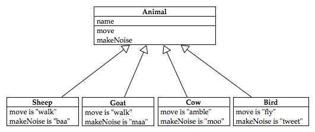
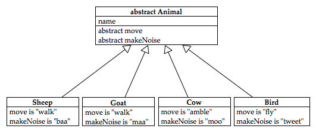
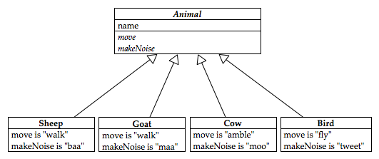

{::options parse_block_html="true" /}

# Summary
Some more notes on exceptions, making and using your own. We'll also have a first look at design patterns and look at an example of how they help design  programs which are easy to extend and maintain.

Book reference: 
  ~ Chapter 1 of Head First Design Patterns;

Resources: 
  ~ Some small examples of Java code (available from the COMP229 iLearn page) to illustrate some of the topics discussed in lectures.

## Overloading, overriding and polymorphism

As we've seen, when subclassing we can override previously defined methods in subclasses. An overridden method has the same name and parameter list as a method in the
superclass. But methods can also be _overloaded_; this happens when the method has the same name as another method in the same class, but has a different parameter list or 
signature.

The related idea _polymorphism_ is when objects of several types can be referred to. This allows programmers to define operations so that the operations appropriate to the 
referenced object is automatically selected at runtime.  An example of this idea is seen in the use of "+" which can be used as addition (when applied to integers) or concatenation when applied
to strings.

## Inheritance and constructors

Constructors are not inherited; usually the default constructor --- i.e. the one without parameters --- is automatically called to initialise inherited data members before the body of its sub-class
constructor is executed. As we saw last week we also have the `super` construct to be able to invoke the other (parameterised) constructors of the super-class. (Have a look at some of the examples
in last week's code bundles.)  The precise constructor to be called by your `super()` call is determined by the parameter list.

## Initialisers

As you've probably seen in various code examples, initialisation is done through the constructors; however Java also provides the option to do that initialisation in initialisation blocks. For example
this might be appropriate when there are many constructors all which must have an array initialised in the same way. The syntax of the initialisation block looks like this:

~~~~~

public MyClass {
  private String[][] mArrayOfStrings;
  { // Initialiser
        mArrayOfStrings= new String[3][5];
         for(int i= 0; j <  3; i++)
           for (int j=0 ; j < 3; j++)
}
 // Constructors
 
 }

~~~~~

With so many things to be initialised in different ways, Java does everything in a particular order:

  * First, initialisaers and then constructors in super classes are executed 
  * next sub-class initialisers
  * and finally the sub-class constructor body is executed.

## Class Hierarchies

As we've seen the classes are arranged in a hierarchy from superclass to subclasses. Common class features should be put as high as possible in the class hierarchy, and classes inherit methods and data from all of their ancestors via their parents. 

In Java all classes have a special class called an _Object_ class as an ancestor --- we say that `Object` is the root of the class hierarchy.

### The `Object` class

The object class  contains some useful methods which are all inherited by all classes:

  *  default, no argument constructor;
  *  `toString()` --- a string representation;
  *  `equals(), hashcode()` --- object equality;
  *  `clone()` --- object replication;
  *  `readObject(), writeObject()` --- serialisation.

Typically subclasses will override these methods to provide class specific features --- and we've already seen some examples of
that.

### Abstract classes

In Java there is a notion of _abstract class_ consisting of abstract methods --- i.e. methods which have declarations and without implementations. Abstract classes cannot be instantiated directly, but their subclasses can. If a class is defined in this way then it is modified with the keyword `abstract` . Abstract classes are used to define broad features of a class.  They are used when you have a superclass for which you _can_ define the fields, but there is no sensible way to define one or more of the methods in the superclass.

Take for example a hierarchy of animals.  We might model sheep, goats, cows and birds according to the following class diagram

How could we implement either `move` or `makeNoise` in the superclass?  There is no reasonable choice which applies to all animals.  The right way to deal with this in OO is to mark those methods as `abstract`.  Marking a method abstract means it is a method signature only, not an implementation.  This is OK in a sense because only a methods signature is part of it's interface with the outside world.  However, objects built from such a class can't possibly work because a call to the abstract method would crash (there is no code there!).  Thus any class with an abstract method must also be labelled `abstract` and you cannot call constructors (instantiate) abstract classes.

The above diagram is not correct UML.  UML has a notation for indicating something is abstract, which is to write it in italics like so

However, most of us don't have a separate italic version of our handwriting.  Even if we did it is doubtful other people would recognise it.  Thus I prefer to use the abstract keywork in my diagrams.  This is an example where official UML falls down as a method of getting your ideas out of your head and onto paper.

### Interfaces

A class entirely composed of abstract  methods  is called an _interface_ and is tagged with the `interface` keyword rather than `class` .

Interfaces and abstract classes enforce a common design structure which must be adhered to by the subclasses which are implemented. Interfaces can also inherit from other interfaces at once (i.e. we can have multiple inheritance at interfaces); moreover classes can also inherit from multiple interfaces by providing implementations for methods.

In fact multiple inheritance via interfaces avoids many of the problems encountered in other languages where multiple inheritance is allowed between arbitrary classes. For example if a class inherits from two implemented parent classes (which is possible in C++) then it's possible that the two parent classes might have conflicting implementations, and moreover how would the subclass's overriding mechanism work, and which parent would `super` refer to?

Doing all of this via interfaces avoids all of that because interfaces don't have any implemented methods to conflict!  Aside: In my opinion the problems with multiple inheritance are overstated, but they are real and using interfaces does solve them.   However, it introduces other problems...

## Catchphrase

In a single four word sentence each, answer each of the following questions:

  * What is the difference between an abstract class and an interface?
  * Why might a method be labelled abstract?
  * What characterises the things we should encapsulate?
  * What is another way of saying "program to an interface"

## Solution
  * There's only abstract methods.
  * There's no sensible implementation.
  * They might change.
  * Program to a supertype.

## Bugs

Download the [payroll code](payroll.zip) and install inside of Eclipse. You should see a number of errors flagged in the project `payroll`, the reasons for them will become apparent as you work through the questions below.

The package `payroll` contains a number of classes devoted to the implementation of a payroll system. The class `Employee` is an  `abstract` class which means that it has an unimplemented method. [Question: can abstract classes be instantiated?] 

The classes `FullTime` and `PartTime` both extend `Employee` .  [Question: what does the keyword `final` mean in the class declarations?] 

The error messages report that you need to implement a constructor for both classes: implement these constructors in the following way. The signatures should be as set out below, where for `FullTime` the variable `s` takes a value which should be assigned to `baseSalary` and for  `PartTime` the variables `r` and `h`  should be assigned to `hourlyRate` and `hours` respectively. You should call the methods `setSalary` , `setRate` and `setHours` to set these variables.
   
~~~~~
public FullTime (String first, String last, double s) 
public PartTime (String first, String last, double r, double h)
~~~~~

Override the `toString` methods using `super` to call the Employee's `toString` method so that when `toString` is called in the `Fulltime` class, for a full-time employee Horace Snooks who has a salary of $1000, the output is:

~~~~~
Full time: Horace Snooks, Salary:  $1000
~~~~~

And a part-time worker `Jane Biggs` who works  4 hours for an hourly rate of $20, should be printed as:

~~~~~
Part time: Jane Biggs, Hourly Rate:  $20, Hours: 4
~~~~~

  *  Implement the `earnings` methods in both the `FullTime` and `PartTime` classes. In `FullTime` it should just return the salary. In `PartTime` it should return the product of the hourly rate and the number of hours worked at the standard rate up to 35 hours, with the bonus rate applied to the number of hours in excess of 35. The standard bonus rate is 1.5 times the hourly rate.

  * Write a `PayRoll` class containing a `main` method which sets up an array of four Employees described below. Your program should set up the array and print out the payroll as follows:

  ~~~~~
  Full time: Fred Smith, Salary:  $1000, Earnings: $1000
  Full time: Samantha Simons, Salary:  $1500, Earnings: $1500
  Part time: Dame Edna Everage,  Hourly Rate: $1000 , Hours: 40, Earnings: $42500
  Part time: Angelina Jolie,  Hourly Rate: $1000 , Hours: 25, Earnings, $25000
  ~~~~~

  Angelina Jolie and Dame Edna Everage are part-time employees and work at a rate of $1000 per hour. (Their bonus rate is 1.5 times their standard hourly rate.) Fred Smith and Samantha Simons are full-time employees. Fred's salary is $1000 per week and Samantha's is $1500 per week. This week Angelina works 25 hours and Dame Edna works 40 hours, and both Samantha and Fred work their normal 35 hours.    
 
  Note you will need to use the `java.io.*` libraries. Note also that a  `System.out.println(g)` automatically calls the `toString()` method for `g` --- you may use this to simplify your program.  In your implementation try to make use of the overridden methods to make your application code as simple as possible.
 
  * Currently the methods `setSalary` , `setRate` and `setHours` don't treat the case where negative salaries, rates and hours worked are input. Change their declaration so that it reads: `public void  setSalary(double s) throws PayrollException ` and change the implementation so that a `PayrollException` is thrown in the case that negative numbers are input.  You should see some errors appearing in your constructor definitions reporting unhandled exceptions. Add a `try ... catch` block to handle the errors so that an appropriate error message is reported.

## Solution
Solution is in `payroll` package of [payroll solutions](payroll_solution.zip) project.

