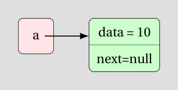
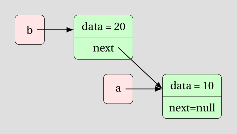
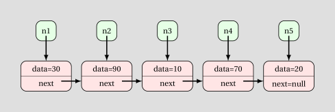
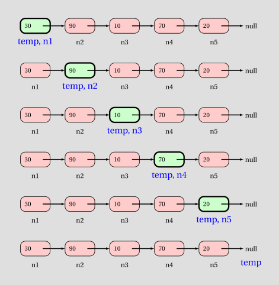
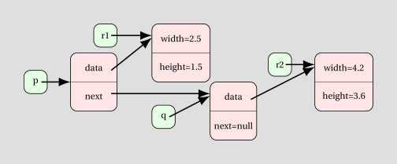
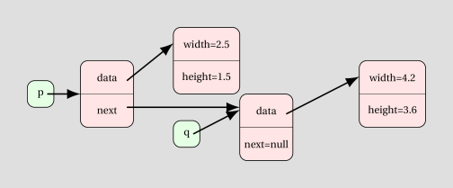

<details class="prereq" markdown="1"><summary>Assumed Knowledge</summary>

  * <a href="./recursion">Recursion</a>
  * <a href="./lists">Lists</a>
</details>

<details class="outcomes" markdown="1"><summary>Learning Outcomes</summary>

  * Be able to create and operate on a class holding one or more references of the same type
</details>

## Author: Gaurav Gupta

# The Node class

<iframe width="560" height="315" src="https://www.youtube.com/embed/fDU7AtmQBjA" frameborder="0" allow="autoplay; encrypted-media" allowfullscreen></iframe>

<p>&nbsp;</p>

Now, consider the following class:

```java
public class Node {
	public int data;
	public Node next;

	public Node(int d, Node n) {
		data = d;
		next = n;
	}
}
```

Every Node object holds a reference to another Node object.

> ```java
> Node a = new Node(10, null);
> ```
>
> 


> ```java
> Node b = new Node(20, a);
> ```
>
> 

> ```java
> Node head = new Node(20, new Node(10, null));
> ```
>
> 

Here, we created an *anonymous* `Node` object - `new Node(10, null)` - and passed it as a parameter to the constructor of `head`.


> ```java
> head.getNext().setNext(new Node(-50, null));
> ```
>
> 


## Linking nodes

<iframe width="560" height="315" src="https://www.youtube.com/embed/Jqu9IpulHvU" frameborder="0" allow="autoplay; encrypted-media" allowfullscreen></iframe>

<p>&nbsp;</p>

We can link any number of nodes as we want.

```java
Node n5 = new Node(20, null);
Node n4 = new Node(70, n5);
Node n3 = new Node(10, n4);
Node n2 = new Node(90, n3);
Node n1 = new Node(30, n2);
```



Simplified representaton:


We can get all the values just using `n1`.

```java
System.out.println(n1.getData()); //30
System.out.println(n1.getNext().getData()); //90
System.out.println(n1.getNext().getNext().getData()); //10
System.out.println(n1.getNext().getNext().getNext().getData()); //70
System.out.println(n1.getNext().getNext().getNext().getNext().getData()); //20
```

If we create a `Node` reference `temp` initialized to `n1`, we can re-reference it to the `Node` after it using `temp = temp.getNext()`. Thereby, repeating the operation over and over.

```java
Node temp = n1; //temp refers to same instance as n1
temp = temp.getNext(); //temp refers to node after temp or n1 which is n2
temp = temp.getNext(); //temp refers to node after temp or n2 which is n3
temp = temp.getNext(); //temp refers to n4
temp = temp.getNext(); //temp refers to n5
temp = temp.getNext(); //temp is now null - STOP
```

Abstracting into a loop to add all the values:

```java
Node temp = n1;
int total = 0;
while(temp != null) {
	total = total + temp.getData();
	temp = temp.getNext();
}
```



## Nodes can hold other objects too

In the previous example, we saw a node holding integer data, but it can hold any kind of data. For starters, take a look at `RNode` holding `Rectangle` object.

For the classes defined in,

- [Rectangle.java](./Rectangle.java),
- [RNode.java](./RNode.java),

Consider the following code,

```java
Rectangle r1 = new Rectangle(2.5, 1.5);
Rectangle r2 = new Rectangle(4.2, 3.6);
RNode q = new RNode(r2, null);
RNode p = new RNode(r1, q);
```



We can create anonymous objects to reduce variable count.

```java
RNode q = new RNode(new Rectangle(4.2, 3.6), null);
RNode p = new RNode(new Rectangle(2.5, 1.5), q);
```



# Homework - 2

### Task 1

For the class [Node](./Node.java), draw the memory diagram to illustrate objects after the last statement of the following code executes.

```java
Node a = new Node(20, null);
Node b = new Node(70, a);
Node c = new Node(10, a);
Node d = new Node(90, c);
```

### Task 2

For the class [Node](./Node.java), draw the memory diagram to illustrate objects after the last statement of the following code executes.

```java
Node a = new Node(20, null);
Node b = new Node(70, a);
Node c = new Node(10, b);
Node d = new Node(90, c);
a.setNext(d);
```

### Task 3

For the class [Node](./Node.java), draw the memory diagram to illustrate objects after the last statement of the following code executes.

```java
Node a = new Node(20, null);
Node b = new Node(70, a);
Node c = new Node(10, b);
Node d = new Node(90, c);
a.setNext(d.getNext());
```

### Task 4

For the class [Node](./Node.java), draw the memory diagram to illustrate objects after the last statement of the following code executes.

```java
Node a = new Node(20, null);
Node b = new Node(70, a);
Node c = new Node(10, b);
Node d = new Node(90, c);
a.setNext(d.getNext().getNext());
```

### Task 5

For the class [Node](./Node.java), the following code attempts to store the sum of all items in the chain of nodes into a varaible `total`. However, it has a a bug. Briefly explain what is the problem with the code, and correct it.

```java
Node a = new Node(20, null);
Node b = new Node(70, a);
Node c = new Node(10, b);
Node d = new Node(90, c);
int total = 0;
Node current = d;
while(current != null) {
	total = total + current;
	current = current.getNext();
}
```

### Task 6

For the class [Node](./Node.java), the following code attempts to store the number of nodes in the chain into a variable `size`. However, it has a a bug. Briefly explain what is the problem with the code, and correct it.

```java
Node a = new Node(20, null);
Node b = new Node(70, a);
Node c = new Node(10, b);
Node d = new Node(90, c);
int size = 0;
Node current = d;
while(current != null) {
	size = size + 1;
}
```

### Task 7

For the class [Node](./Node.java), what is the value of `result` after the following code is executed?

```java
Node a = new Node(20, null);
Node b = new Node(70, a);
Node c = new Node(10, b);
Node d = new Node(90, c);
int result = 0;
Node current = d;
while(current != null) {
	if(current.getData() >= 20) {
		result = result * 10 + 1;
	}
	else {
		result = result * 10;
	}
	current = current.getNext();
}
```

### Task 8

For the class [Node](./Node.java), what is the value of `result` after the following code executes?

```java
Node a = new Node(9, null);
Node b = new Node(2, a);
Node c = new Node(7, b);
Node d = new Node(1, c);
a.setNext(d);
a.setData	(
				1000*d.getData() +
				100*d.getNext().getData() +
				10*d.getNext().getNext().getData() +
				1*d.getNext().getNext().getNext().getData()
			);
```

### Task 9

Consider the following class definition for `TreeNode`:

```java
public class TreeNode {
	public int data;
	public TreeNode left, right;
	public TreeNode(int d, TreeNode l, TreeNode r) {
		data = d;
		left = l;
		right = r;
	}
}
```

Draw the memory diagram to illustrate objects after the last statement of the following code executes. Also, state the number of instances and references in the diagram.

```java
TreeNode t1 = new TreeNode(20, null, null);
TreeNode t2 = new TreeNode(-10, null, null);
TreeNode t3 = new TreeNode(70, t1, t2);
```
